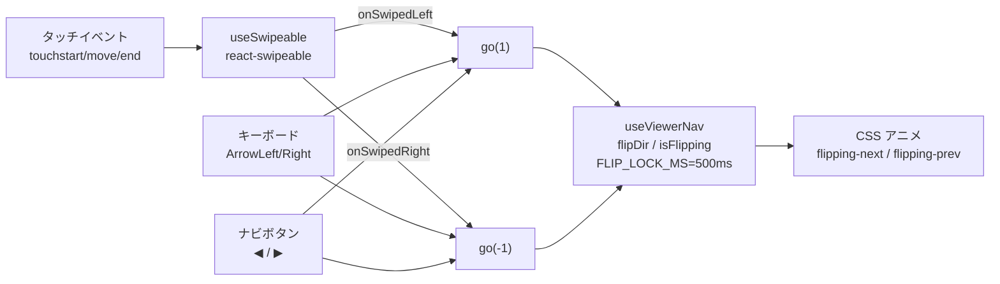

# Architecture Design: えほんやさん（Ehon）

> Source: SPEC.md (2026-05-04 / Tweaks 縮小版 → 2026-05-05 で Tweaks 完全削除)
> Source: UI_SPEC.md (2026-05-04 / Tweaks 縮小版 → 2026-05-05 で Tweaks 完全削除)
> Source: DISCOVERY_RESULT.md (2026-05-04) / project-rules.md (2026-05-04)
> Source: docs/design-notes/tweaks-simplification.md (2026-05-04)
> Source: docs/design-notes/remove-tweaks-panel.md (2026-05-05)
> Source: docs/design-notes/page-turn-animation.md (2026-05-05)
> Created: 2026-05-04
> Last updated: 2026-05-06
> Update history:
>   - 2026-05-04: Initial draft (architect / Delivery Flow Light プラン)
>   - 2026-05-04: Tweaks 機能の本番固定化 (architect / Tweaks 型を 4 フィールドに縮小、CSS 変数同期 useEffect を 2 本削減、ADR-008 追記、実装順序を Phase A〜E に再構成)
>   - 2026-05-05: Tweaks 機能の完全削除 (architect / TweaksPanel/Launcher/Provider/Context/Reducer 削除、useSettingsStore (custom hook) へ置換、ADR-009 追記、実装順序を Phase 1〜5 に再構成)
>   - 2026-05-06: タッチスワイプ対応 Phase 1 を追加 (architect / react-swipeable 採用、ADR-010 追記、ViewerA/ViewerB の `.eh-viewer-stage` にスワイプジェスチャ統合、R-018/R-019 追加)

## 1. アーキテクチャ概要

### システム図

```mermaid
flowchart TB
  subgraph Browser[Webブラウザ]
    direction TB
    UI[React Tree<br/>App → Shelf/Viewer]
    Store[(useSettingsStore<br/>custom hook)]
    LS[(localStorage<br/>key: eh.settings)]
    Static[Static assets<br/>(stories.ts, illustrations/*.webp)]
    UI <-->|read/write| Store
    Store <-->|persist| LS
    UI -->|read| Static
  end
  Vercel[Vercel Edge CDN] -->|HTTPS / static| Browser
  Repo[GitHub repo<br/>main branch] -->|build & deploy| Vercel
```

- フロントエンド単一の SPA（バックエンド・DB・認証なし）
- Vercel ホスティング（静的サイト）
- 状態は軽量カスタム hook (`useSettingsStore`) + localStorage に閉じる
- 物語データはビルド時静的、挿絵は `public/illustrations/` 配下に静的配置 + フォールバック

### 採用アーキテクチャパターン

- **コンポーネント駆動 UI + Custom Hooks**
  - `App` がルート、ビュアー / 本棚を `App` が直接ホスト（Provider 不要）
  - 本棚 / ビュアー切替は `settings.shelfVariant` / `settings.viewerVariant` を見て分岐レンダ
  - キーボード・ページ送り等の振舞いは Custom Hook (`useViewerNav` 等) に切り出し
  - 設定状態は `useSettingsStore()` 単一 hook で取得（Context Provider なし）
- **Feature-based + Layer-based ハイブリッドのディレクトリ構成**（後述 §2）
- **トークン駆動スタイル**: CSS Custom Properties (`--paper`, `--ink`, `--terracotta` 等) を `:root` に集約。ランタイム書換は廃止し、固定値を `tokens.css` に直書きする方針へ移行（ADR-008）

### Tech Stack（確定版）

| Layer | Technology | Version | 採用根拠 |
|------|-----------|---------|---------|
| 言語 | TypeScript | 5.4+ | strict mode 必須、project-rules.md / SPEC.md 確定 |
| ランタイム (dev) | Node.js | ≥ 20 LTS | Vite 5 / pnpm の前提 |
| UI | React | 18.3+ | モック踏襲、`useState` / Hooks 安定 |
| ビルド | Vite | 5.x | 高速 HMR、TS/JSX ネイティブ、Vercel 親和 |
| パッケージ | pnpm | 9.x | project-rules.md 推奨 |
| 状態管理 | カスタム hook (`useSettingsStore`) | (内蔵) | Settings 1 種のみ。Provider/Context/Reducer の階層を排し `useState` + `useEffect` で完結（ADR-009） |
| ふりがな処理 | 自前パーサ | — | `桃太郎{ももたろう}` 記法。外部依存ゼロ |
| タッチジェスチャ | `react-swipeable` | 7.x | スワイプ閾値・方向検出を React hook 形式で薄くラップ。bundle gzip +約 4 kB（ADR-010） |
| スタイル | CSS (素 / モック踏襲) | — | モック確立済みトークンを `:root` 移植。CSS Modules はオプション |
| Lint | ESLint | 8.x + `@typescript-eslint` 7.x + `eslint-plugin-react-hooks` 4.x + `eslint-plugin-jsx-a11y` 6.x | a11y 検証必須 (`<ruby>` SR / aria-label) |
| Format | Prettier | 3.x | project-rules.md 確定 |
| ユニットテスト | Vitest | 1.x | Vite 統合 |
| ライブラリ補助 | @testing-library/react | 14.x | コンポーネントテスト |
|  | @testing-library/jest-dom | 6.x | カスタムマッチャ |
|  | @testing-library/user-event | 14.x | キーボード・タップシミュレーション |
| E2E | Playwright | 1.44+ | クロスブラウザ + iPad プロファイル必須 |
| ホスティング | Vercel | — | Operations Flow で確定。`vercel.json` SPA リライト |

### 採用ライブラリ（最小限・library-and-security-policy.md 準拠）

| Library | 目的 | 採用基準確認 |
|---------|------|-------------|
| `react` / `react-dom` 18 | UI ライブラリ | 業界標準、active maintained, MIT |
| `vite` 5 + `@vitejs/plugin-react` | ビルド / HMR | active maintained, MIT |
| `typescript` 5 | 型安全 | active maintained, Apache-2.0 |
| `eslint` + 関連プラグイン | Lint / a11y | active maintained, MIT |
| `prettier` | Format | active maintained, MIT |
| `vitest` + `@vitest/ui` (任意) | ユニットテスト | active maintained, MIT |
| `@testing-library/*` | テスト補助 | active maintained, MIT |
| `@playwright/test` | E2E | active maintained, Apache-2.0 |
| `jsdom` | Vitest 環境 | active maintained, MIT |
| `react-swipeable` 7.x | タッチスワイプ検出 hook | active maintained, MIT, gzip 約 4 kB。週 DL 100 万超で安定。`useSwipeable({ onSwipedLeft, onSwipedRight })` の薄いラッパで本プロジェクトに最適（ADR-010） |

> **追加候補は最小化**:
> - i18n / Routing / 状態管理ライブラリは導入しない (MVP 不要)
> - **Zustand 等の状態管理ライブラリは ADR-009 で明確に却下**。Settings は単一 hook で完結
> - フォントは Google Fonts URL 直参照（`<link>`）。本番固定化に伴い M PLUS Rounded 1c のみを残し、その他のフォント `<link>` は `index.html` から除去する（ADR-008）
> - Markdown / 画像処理ライブラリは MVP 不要
> - **アニメーションライブラリ (Framer Motion / React Spring) は採用しない**: 既存 CSS の `rotateY` で十分。ドラッグ追従が必要になった場合のみ Phase 3 候補として再検討（ADR-010）

## 2. ディレクトリ構造

```
ehon/
├── public/
│   ├── illustrations/        # 実画像挿絵（ユーザー段階配置）
│   │   ├── akazukin/
│   │   │   ├── cover.webp    # 表紙
│   │   │   ├── forest-girl.webp
│   │   │   ├── basket.webp
│   │   │   └── ... (各 scene)
│   │   ├── momotaro/
│   │   ├── shirayuki/
│   │   ├── tsurunoongaeshi/
│   │   ├── bremen/
│   │   └── kasajizo/
│   ├── favicon.svg
│   └── og-image.png
├── src/
│   ├── main.tsx                       # createRoot エントリ
│   ├── App.tsx                        # ルートコンポーネント（Provider 不要 / useSettingsStore 直接呼び出し）
│   ├── components/
│   │   ├── shelves/
│   │   │   ├── ShelfA.tsx             # 立てかけ書架
│   │   │   ├── ShelfB.tsx             # 表紙ならべ
│   │   │   ├── ShelfSwitcher.tsx
│   │   │   └── TagFilter.tsx
│   │   ├── viewers/
│   │   │   ├── ViewerA.tsx            # 見開き
│   │   │   ├── ViewerB.tsx            # 全画面背景
│   │   │   ├── ViewerBar.tsx          # 上部ツールバー
│   │   │   ├── CoverPage.tsx          # 表紙ページ（共通）
│   │   │   └── PageNumber.tsx
│   │   ├── common/
│   │   │   ├── EhButton.tsx
│   │   │   ├── EmptyState.tsx
│   │   │   ├── ErrorBoundary.tsx
│   │   │   ├── IllustWithFallback.tsx # 挿絵 + フォールバック
│   │   │   └── RubyText.tsx
│   │   └── layout/
│   │       └── Header.tsx
│   ├── hooks/
│   │   ├── useViewerNav.ts            # ページ送り・キーボード
│   │   └── useFocusTrap.ts            # ビュアー a11y
│   ├── lib/
│   │   ├── ruby-parser.ts             # 漢字{かんじ} → <ruby>
│   │   ├── ruby-parser.types.ts
│   │   ├── illustration-path.ts       # storyId/scene → /illustrations/...
│   │   └── safe-storage.ts            # localStorage の try/catch ラッパ
│   ├── stores/
│   │   └── settings-store.ts          # useSettingsStore() / SETTINGS_DEFAULTS / normalizeSettings
│   ├── data/
│   │   └── stories.ts                 # 6 作品の物語データ + 型
│   ├── styles/
│   │   ├── tokens.css                 # CSS 変数（モック由来 + 固定値の直書き）
│   │   ├── global.css                 # html/body リセット + ruby
│   │   ├── ehon.css                   # モック CSS 移植（components 横断）
│   │   └── reduced-motion.css         # prefers-reduced-motion
│   └── types/
│       ├── story.ts                   # Story / Page 型
│       └── settings.ts                # Settings / SettingsKey 型（4 フィールド）
├── tests/
│   ├── unit/
│   │   ├── ruby-parser.test.ts
│   │   ├── settings-store.test.ts
│   │   ├── illustration-path.test.ts
│   │   ├── safe-storage.test.ts
│   │   ├── ShelfA.test.tsx
│   │   ├── ShelfB.test.tsx
│   │   ├── ViewerA.test.tsx
│   │   ├── ViewerB.test.tsx
│   │   ├── TagFilter.test.tsx
│   │   └── App.smoke.test.tsx
│   └── e2e/
│       ├── home.spec.ts               # 本棚 → ビュアー → 戻る
│       ├── viewer-keyboard.spec.ts    # キーボード完結
│       ├── viewer-swipe.spec.ts       # ★ 新規 (Phase 1 / 2026-05-06): スワイプでページ送り
│       ├── ruby-toggle.spec.ts        # ふりがな切替
│       ├── persistence.spec.ts        # localStorage 永続化（新キー eh.settings 対象）
│       ├── responsive-ipad.spec.ts    # iPad プロファイル
│       └── image-fallback.spec.ts     # 画像不在シナリオ
├── docs/                              # Aphelion 成果物（既存）
├── mock/                              # 既存モック退避（scaffolder で移動）
├── .claude/
├── index.html                         # Vite エントリ。フォント <link> は M PLUS Rounded 1c のみ
├── vite.config.ts
├── tsconfig.json
├── tsconfig.node.json                 # vite.config.ts 用
├── package.json
├── pnpm-lock.yaml
├── playwright.config.ts
├── vitest.config.ts
├── .eslintrc.cjs
├── .prettierrc
├── .gitignore
├── .gitattributes
├── vercel.json                        # SPA リライト（Operations 担当）
├── README.md
├── CHANGELOG.md
├── LICENSE
└── LICENSE-illustrations.md           # Operations Flow 担当
```

> **`mock/` の扱い**: scaffolder 段階で既存モック (`Ehon.html`, `app.jsx`, `tweaks-panel.jsx`, `components/`, `data/`, `styles/`) を `mock/` に移動。`tsconfig.json` の `exclude` と Vite `optimizeDeps` で本番ビルドから除外する（R-009）。削除はしない（IR-005 / project-rules）。
>
> **本番固定化に伴う削除ファイル（ADR-008 / 完了済）**: `src/components/tweaks/TweakColor.tsx` / `TweakSelect.tsx` / `TweakSlider.tsx` / `src/lib/accent-presets.ts` / `src/lib/font-presets.ts` の 5 ファイルは削除済。
>
> **Tweaks 完全削除に伴う削除ファイル（ADR-009 / 完了済）**: `src/components/tweaks/` ディレクトリ全体、`src/stores/tweaks-*.ts(x)` 3 ファイル、`src/types/tweaks.ts`、tweaks 系 unit テスト 3 本。
>
> **タッチスワイプ Phase 1 に伴う追加（ADR-010 / 本フェーズ）**:
> - `package.json` の `dependencies` に `react-swipeable` を追加
> - `tests/e2e/viewer-swipe.spec.ts` を新規作成（Playwright touch エミュレーションでスワイプによる前後遷移を検証）
> - 新規モジュール追加は **行わない**: `useSwipeable` を `ViewerA.tsx` / `ViewerB.tsx` 内で直接呼び出し、既存 `useViewerNav.go(±1)` を呼ぶ薄い接合に留める

## 3. モジュール設計

### `App` (src/App.tsx)
- **責務**: 全アプリのルート。`ErrorBoundary` でラップ。本棚 / ビュアーの表示制御
- **依存**: `ErrorBoundary`, `ShelfA`, `ShelfB`, `ViewerA`, `ViewerB`, `useSettingsStore`
- **公開インターフェース**: なし（Root）
- **状態**: `openId: string | null` (ビュアー対象) / `selectedTags: string[]`

### `useSettingsStore` (src/stores/settings-store.ts)
- **責務**: Settings 4 キーの保持・更新・永続化。Provider 不要のシングル hook 実装
- **依存**: `safe-storage.ts`, `src/types/settings.ts`
- **公開インターフェース**:
  ```ts
  export type Settings = {
    shelfVariant: 'A' | 'B';
    viewerVariant: 'A' | 'B';
    ruby: boolean;
    night: boolean;
  };
  export type SettingsKey = keyof Settings;

  export const SETTINGS_DEFAULTS: Settings;
  export function normalizeSettings(value: unknown): Settings; // whitelist 抽出

  export function useSettingsStore(): {
    settings: Settings;
    setSetting: <K extends SettingsKey>(key: K, value: Settings[K]) => void;
    reset: () => void;
  };
  ```
- **永続化キー**: `eh.settings`（v1）。**旧 `eh.tweaks` / `ehon.tweaks` / `ehon.tweaks.v2` は読まない・削除しない**
- **副作用（useEffect 3 本）**:
  - 書込: `settings` 変更時に `safe-storage.set('eh.settings', settings)`
  - night 同期: `document.documentElement.classList.toggle('night', settings.night)`
  - ruby 同期: `document.documentElement.classList.toggle('no-ruby', !settings.ruby)`

### `ruby-parser` (src/lib/ruby-parser.ts)
- **責務**: `桃太郎{ももたろう}` 形式を `<ruby><rb>桃太郎</rb><rt>ももたろう</rt></ruby>` に変換
- **依存**: なし（純関数）
- **公開インターフェース**:
  ```ts
  export type RubyToken = { type: 'plain'; text: string } | { type: 'ruby'; base: string; rt: string };
  export function parseRuby(input: string): RubyToken[];
  export function renderRuby(input: string): React.ReactNode;
  ```

### `useViewerNav` (src/hooks/useViewerNav.ts)
- **責務**: ビュアー内のページ送り・キーボードナビ・アニメーションロック
- **依存**: なし（React Hooks のみ）
- **公開インターフェース**:
  ```ts
  export function useViewerNav(totalPages: number, onClose: () => void): {
    pageIndex: number;          // 0=表紙, 1..N=本文
    total: number;              // totalPages + 1
    flipDir: 'next' | 'prev' | null;
    isFlipping: boolean;        // 500ms ロック中 true
    go: (delta: number) => void;
  };
  ```
- **キーボード**: `ArrowRight` → `go(1)`, `ArrowLeft` → `go(-1)`, `Escape` → `onClose()`
- **アニメーションロック**: `flippingRef` + `isFlipping` state で 500ms (`FLIP_LOCK_MS`) 間 `go` を抑制
- **本フェーズ (Phase 1) では改変しない**: スワイプは `useSwipeable` の onSwipedLeft/Right から本フックの `go(±1)` を呼ぶ形で統合する。`isFlipping` 中の `go` 抑制ロジックがそのままスワイプにも適用されるため、追加ロックは不要

### スワイプジェスチャ統合（Phase 1 / ADR-010）

ビュアー内のタッチスワイプは `react-swipeable` の `useSwipeable` フックを `ViewerA.tsx` / `ViewerB.tsx` 内で直接呼び出して実装する。新たな custom hook は導入せず、既存 `useViewerNav.go(±1)` を呼ぶ薄い接合層に留める。

#### 統合ポイントと既存抽象との関係



- スワイプ・キーボード・ボタンの 3 入力経路はすべて `useViewerNav.go(delta)` に集約される
- `isFlipping === true`（500ms ロック中）はスワイプ起因の `go` も既存ロジックで自動的に無視される
- スワイプ専用のロックや状態は導入しない

#### 適用対象の DOM

- 装着先: ViewerA は `.book-a` を含むステージ要素、ViewerB は `.eh-viewer-stage` 等の本文表示エリア
- **`<ViewerBar>` には装着しない**: バー上のボタン（ふりがな・夜モード・閉じる）タップとスワイプの誤検知を避けるため、スワイプ検出を本文ステージのみに限定する
- **`<ruby>` 構造には影響を与えない**: `useSwipeable` はルート要素にイベントハンドラを束ねるだけで、子の DOM 構造（`<ruby><rb>...</rb><rt>...</rt></ruby>`）を改変しない

#### `useSwipeable` の設定値

| オプション | 値 | 意図 |
|------------|---|------|
| `onSwipedLeft` | `() => go(1)` | 左スワイプで次ページ |
| `onSwipedRight` | `() => go(-1)` | 右スワイプで前ページ |
| `delta` | `50`（px） | analyst 推奨の閾値。誤動作・テキスト範囲選択との切り分けが安定する経験値 |
| `preventScrollOnSwipe` | `false` | テキストカード内の縦スクロールやネイティブのスクロールジェスチャを阻害しない |
| `trackMouse` | `false` | 本番ではマウスドラッグでページが動かないようにする（PC でデバッグしたいときのみ true に切替可） |
| `trackTouch` | `true`（デフォルト） | タッチデバイスでのみスワイプを有効化 |

#### reduced-motion / アクセシビリティ

- `prefers-reduced-motion: reduce` でも **スワイプ機能は維持** する（操作手段は失わない）
- アニメーション抑制は既存 CSS（`reduced-motion.css`）が `flipping-*` クラスのアニメを停止する形で対応済み。スワイプ起因か否かに関わらず同じパスで処理される
- キーボード操作（←/→ / Esc）と ◀/▶ ボタンは引き続き動作する（**スワイプは追加手段であり代替ではない**）
- スワイプは VoiceOver / NVDA など SR ユーザーの操作経路には影響しない

#### Phase 2（将来課題、本フェーズの対象外）

ページ進行率にジェスチャを連動させる "drag-to-flip" や、めくり中の影 / `perspective` 親要素・キーフレーム強化などの **CSS アニメ表現の改善は別 PR** で扱う。Phase 2 着手時に再度 architect を起動し、設計メモ `docs/design-notes/page-turn-animation.md` の Phase 2 章を再活用する想定。

### `IllustWithFallback` (src/components/common/IllustWithFallback.tsx)
- **責務**: 挿絵画像の表示と onError フォールバック
- **依存**: `illustration-path.ts`
- **挙動**:
  1. `` を初期描画
  2. onError で `loaded === false` 状態に遷移し、`<div style="background: bgColor">` + 中央配置の絵文字 + `<span aria-hidden>{emoji}</span>` を表示

### `safe-storage` (src/lib/safe-storage.ts)
- **責務**: localStorage を安全に扱う（try/catch、in-memory fallback）

### `ShelfA` / `ShelfB` (src/components/shelves/*.tsx)
- **責務**: 本棚レイアウト 2 バリアント。タグフィルター結果で物語を表示

### `ViewerA` / `ViewerB` (src/components/viewers/*.tsx)
- **責務**: ビュアーレイアウト 2 バリアント。`useViewerNav` で状態管理し、本フェーズから `useSwipeable` でタッチスワイプを受け付ける
- **依存**: `useViewerNav`, `useSwipeable` (react-swipeable), `RubyText`, `IllustWithFallback`, `ViewerBar`, `CoverPage`
- **本フェーズの追加 props はなし**: スワイプは内部実装の追加。外部 API は変更しない

### `ViewerBar` (src/components/viewers/ViewerBar.tsx)
- **責務**: ビュアー上部のツールバー
- **本フェーズでは変更なし**: スワイプ装着先からは外す（タップ衝突回避）

### `ErrorBoundary` (src/components/common/ErrorBoundary.tsx)
- **責務**: React クラッシュ時に本棚へ復帰可能にする（IR-008）

## 4. データモデル（実装レベル）

### `Story` 型 (src/types/story.ts)

```ts
export type Story = {
  id: string;
  title: string;
  titleRuby: string;
  author: string;
  origin: string;
  tags: string[];
  coverColor: string;
  coverAccent: string;
  spine: string;
  description: string;
  placeholderEmoji: string;
  pages: Page[];
};

export type Page = {
  scene: string;
  bg: string;
  text: string;
  ruby: string;
};
```

### `Settings` 型 (src/types/settings.ts) — Tweaks 完全削除版（4 フィールド）

```ts
export type Settings = {
  shelfVariant: 'A' | 'B';
  viewerVariant: 'A' | 'B';
  ruby: boolean;
  night: boolean;
};

export type SettingsKey = keyof Settings;

export const SETTINGS_DEFAULTS: Settings = {
  shelfVariant: 'A',
  viewerVariant: 'A',
  ruby: true,
  night: false,
};
```

#### 固定値（CSS 変数として `tokens.css` に直書き）

| CSS 変数 | 固定値 | 用途 |
|----------|--------|------|
| `--terracotta` | `#E07856` | アクセントカラー |
| `--font-body` | `'M PLUS Rounded 1c', system-ui, sans-serif` | 本文フォント |
| `--font-display` | `'M PLUS Rounded 1c', system-ui, sans-serif` | 見出しフォント |
| `--font-size-body` | `26px` | 本文文字サイズ |

### localStorage キー / 形式

- 新キー: `eh.settings`
- 値: `Settings` の JSON 文字列
- 復元時バリデーション: `normalizeSettings` が whitelist 方式で 4 キーのみを取り出す
- **旧キー `eh.tweaks` / `ehon.tweaks` / `ehon.tweaks.v2` は読まない・削除しない**

## 5. API 設計

該当なし（バックエンドなし）。

## 6. State Management Design

```mermaid
flowchart LR
  A[App] -->|calls| US[useSettingsStore]
  US -->|state| Settings[(settings state<br/>4 keys)]
  US -->|effect| LS[localStorage<br/>'eh.settings']
  US -->|effect| HtmlClass[document.documentElement<br/>.night / .no-ruby class]
  Settings -->|props| Shelf[ShelfA/ShelfB]
  Settings -->|props| Viewer[ViewerA/ViewerB]
  A -->|local state| OpenId[openId: string \| null]
  A -->|local state| Tags[selectedTags: string[]]
```

### 状態の所在

| 状態 | 所在 | 永続化 |
|------|------|--------|
| `settings` (4 キー) | `useSettingsStore` (`useState`) | localStorage `eh.settings` |
| `openId` | `App` の useState | URL クエリ（Could） |
| `selectedTags` | `App` の useState | しない |
| `pageIndex` / `flipDir` / `isFlipping` | `useViewerNav` の useState / useRef | しない |

## 7. 認証 / 認可

該当なし。

## 8. エラーハンドリング方針

### React コンポーネントクラッシュ
- `<ErrorBoundary>` でアプリ全体をラップ（IR-008）

### localStorage 失敗
- `safe-storage.ts` 経由で `try/catch`、失敗時は `console.warn` のみ

### 画像取得失敗
- `IllustWithFallback` の `onError` で fallback モードに遷移

### スワイプライブラリ取得失敗（Phase 1 追加）
- `react-swipeable` は通常の npm 依存として bundle に含まれるためランタイム取得失敗は発生しない
- 万が一フックがエラーをスローしても `<ErrorBoundary>` で捕捉され、ボタン / キーボードのナビは継続して動作する

## 9. テスト戦略

| Test Type | Tool | Coverage Target | Scope |
|-----------|------|-----------------|-------|
| Unit | Vitest + @testing-library/react | ≥ 80% (lines) | `lib/*`, `stores/settings-store.ts`, 主要コンポーネント |
| Integration | Vitest | — | App + Shelf + Viewer |
| E2E | Playwright | 主要動線 7 シナリオ（Phase 1 で +1） | 本棚 / ビュアー / スワイプ / 永続化 / レスポンシブ |
| Accessibility | axe-core (Playwright) + 手動 | Lighthouse a11y ≥ 95 | 全画面 |

### Phase 1 (タッチスワイプ) に伴うテスト追加 / 修正

- **追加 E2E**: `tests/e2e/viewer-swipe.spec.ts`
  - Playwright の `page.locator('.eh-viewer-stage').dispatchEvent('touchstart' / 'touchmove' / 'touchend')` か、`@playwright/test` の `device` プロファイル + `page.touchscreen.swipe` 相当でスワイプを発火
  - ケース: (a) 左スワイプで次ページ、(b) 右スワイプで前ページ、(c) 50px 未満のスワイプは反応しない、(d) 縦スワイプは無視される、(e) 500ms ロック中の連続スワイプ 2 回目が無視される
- **既存 E2E の維持**: `viewer-keyboard.spec.ts` / `home.spec.ts` は既存ケースをそのまま維持し、ボタン / キーボードナビが破壊されていないことを担保（回帰防止）
- **ユニットテスト**: ViewerA / ViewerB のスワイプ統合は jsdom + @testing-library での touch シミュレーションが煩雑なため E2E に集約する。ただし `useViewerNav` 既存テストは維持

### E2E テストポリシー（HAS_UI: true）

- **採用ツール**: Playwright
- **対象ブラウザ**: Chromium（必須）/ WebKit（iPad 検証必須）/ Firefox（任意）
- **実行モード**: ローカル開発時 headed、CI は headless
- **対象シナリオ**:
  1. `home.spec.ts`: 本棚 → 物語選択 → 表紙 → 全ページ閲覧 → 戻る
  2. `viewer-keyboard.spec.ts`: マウスを使わず本棚 → ビュアー → ←/→ → Esc が完了
  3. `viewer-swipe.spec.ts` (★ Phase 1 新規): タッチスワイプで前後ページ送り
  4. `ruby-toggle.spec.ts`: ふりがな切替で `<rt>` の可視性が変わる
  5. `persistence.spec.ts`: Settings 4 キー変更 → リロード → 復元
  6. `responsive-ipad.spec.ts`: iPad プロファイルでレイアウト崩れなし、`100dvh` 適用確認
  7. `image-fallback.spec.ts`: 画像不在時にフォールバック表示

## 10. 実装順序 / 依存関係

> **Phase 1 (タッチスワイプ対応) — 本フェーズで対象**
>
> ブランチ: `feat/swipe-gesture` (main から切る。最初の implementation-tier agent (developer) が作成)
> 関連: `docs/design-notes/page-turn-animation.md` Phase 1 章
> 対応 Issue: #5

```
Phase 1: タッチスワイプ対応 (react-swipeable)
  └─ TASK-1-1: 依存追加
                pnpm add react-swipeable
                package.json / pnpm-lock.yaml の更新確認
                (依存なし。最初に実行)
  └─ TASK-1-2: ViewerA にスワイプ統合
                src/components/viewers/ViewerA.tsx
                - useSwipeable をインライン import
                - .eh-viewer-stage 相当のステージルートにハンドラを bind
                - onSwipedLeft → go(1), onSwipedRight → go(-1), delta=50
                - preventScrollOnSwipe=false, trackMouse=false
                (TASK-1-1 後)
  └─ TASK-1-3: ViewerB にスワイプ統合
                src/components/viewers/ViewerB.tsx
                - 同上の設定で本文ステージにハンドラを bind
                - ViewerBar には絶対に装着しないことを確認
                (TASK-1-1 後 / TASK-1-2 と並行可)
  └─ TASK-1-4: E2E テスト追加
                tests/e2e/viewer-swipe.spec.ts
                - 左/右スワイプ・閾値未満・縦スワイプ・連続スワイプ (500ms ロック) の 5 ケース
                (TASK-1-2 / 1-3 後)
  └─ TASK-1-5: ドキュメント更新 (developer が実施)
                - SPEC.md: UC-006 「ページを送る・戻す」に「スワイプ」追加 + 受入基準追記
                  受入基準: 50px 以上の左右スワイプで前後ページ遷移 / 500ms ロック中スワイプ無視 / 垂直スワイプ無視
                - UI_SPEC.md: SCR-002 Interactions テーブル L293-294 を「左/右スワイプで前後ページ」に置換
                  Accessibility 節に「キーボードとボタンは引き続き使用可能 (スワイプは追加手段)」を明記
                  Animations 節は変更なし (アニメは Phase 2)
                - 詳細は本ファイル §10 末尾「SPEC.md / UI_SPEC.md 差分更新方針 (Phase 1)」を参照
                (TASK-1-2 / 1-3 後 / TASK-1-4 と並行可)
  └─ TASK-1-6: 検証
                - pnpm typecheck / pnpm lint / pnpm format:check / pnpm test 全 pass
                - pnpm test:e2e (主要シナリオ + 新 swipe ケース) pass
                - pnpm build でバンドルサイズ計測 (raw / gzip)、PR 説明に記載
                  AC-6: gzip +15 kB 以内が目安。react-swipeable は約 +4 kB
                (TASK-1-1〜1-5 後 / 最終)
```

> commit 粒度の目安（design-notes Phase 1 §7 に準拠）:
> - `chore: react-swipeable を依存追加 (TASK-1-1)`
> - `feat: ViewerA/B にタッチスワイプでページ送りを実装 (TASK-1-2 / 1-3)`
> - `test: スワイプ E2E (viewer-swipe.spec.ts) を追加 (TASK-1-4)`
> - `docs: SPEC.md / UI_SPEC.md / ARCHITECTURE.md にスワイプ仕様を反映 (TASK-1-5)`

### SPEC.md 差分更新方針（TASK-1-5 委譲分）

| 節 | 変更内容 |
|----|----------|
| Update history | `2026-05-06: タッチスワイプ Phase 1 (developer / UC-006 にスワイプ操作追加 / 受入基準追記)` を追記 |
| 1. Scope (IN) | 「ページ送り（ボタン / キーボード ←/→ / **タップ**）」 → 「ページ送り（ボタン / キーボード ←/→ / **タッチスワイプ**）」 |
| 4. UC-006 正常フロー | 「ナビボタン (◀/▶) / キーボード (←/→) / タップ（画面左右半分）」 → 「ナビボタン (◀/▶) / キーボード (←/→) / タッチスワイプ (左/右)」に変更（実装されていなかった「画面半分タップ」を「スワイプ」に置換） |
| 4. UC-006 受入基準 | 以下を追記:<br/>- 50px 以上の左/右スワイプで前/次ページに遷移する<br/>- 500ms のフリップロック中はスワイプも無視される<br/>- 垂直方向のスワイプは無視される（縦スクロールを阻害しない）<br/>- スワイプはタッチデバイスで機能（`trackTouch=true`）。マウスでは反応しない（`trackMouse=false`） |
| 11. 受入条件サマリー | 「(2026-05-06 追加) タブレット / スマホでスワイプによるページ送りが機能する (左→次 / 右→前)」を追記 |

### UI_SPEC.md 差分更新方針（TASK-1-5 委譲分）

| 節 | 変更内容 |
|----|----------|
| Update history | `2026-05-06: ビュアーのタッチスワイプ Phase 1 (developer / SCR-002 Interactions の「画面半分タップ」を「左/右スワイプ」に置換、Accessibility 節に補足)` を追記 |
| 4. SCR-002 Interactions (L293-294) | 「▶ ボタン / → キー / **画面右半分タップ**」 → 「▶ ボタン / → キー / **左スワイプ (タッチ)**」<br/>「◀ ボタン / ← キー / **画面左半分タップ**」 → 「◀ ボタン / ← キー / **右スワイプ (タッチ)**」<br/>※ 「画面半分タップ」は実装されていなかったため、本フェーズでスワイプに置換する |
| 4. SCR-002 Component Details | 必要に応じて「ステージ要素 (`.eh-viewer-stage` 相当) は `useSwipeable` のターゲット」と注記 |
| 5. Shared Components | 変更なし（スワイプは Viewer 固有のため Shared 化しない） |
| 7. Accessibility Requirements (SCR-002) | 「キーボード (←/→/Esc) とナビボタン (◀/▶) は引き続き使用可能。スワイプは追加手段であり、SR / キーボード操作の代替ではない」を追記 |
| 8. Animations / Transitions | 変更なし（アニメ強化は Phase 2 に分離） |

> Phase 2（CSS アニメ強化）は本フェーズの対象外。Phase 2 着手時に再度 architect を起動し、設計メモの Phase 2 章を再活用する。

## 11. 環境 / 設定

### 環境変数（MVP では基本ゼロ）

- `VITE_OG_IMAGE_URL`（任意）

### 設定ファイル

| File | 役割 | 担当 |
|------|------|------|
| `package.json` | 依存・スクリプト（**Phase 1 で `react-swipeable` を追加**） | scaffolder / developer |
| `pnpm-lock.yaml` | ロック | developer |
| `tsconfig.json` | TS 設定 (strict, jsx: react-jsx) | scaffolder |
| `tsconfig.node.json` | vite.config 用 | scaffolder |
| `vite.config.ts` | Vite 設定 | scaffolder |
| `vitest.config.ts` | Vitest 設定 (jsdom) | scaffolder |
| `playwright.config.ts` | Playwright 設定 (Chromium / WebKit, iPad プロファイル) | test-designer |
| `.eslintrc.cjs` | ESLint | scaffolder |
| `.prettierrc` | Prettier | scaffolder |
| `.gitignore` | git 除外 | scaffolder |
| `index.html` | Vite エントリ HTML | scaffolder |
| `vercel.json` | SPA リライト | Operations Flow `infra-builder` |

## 12. 既知のリスクと緩和策

| Risk | Impact | Mitigation |
|------|--------|------------|
| R-001: 夜モード `--mustard` のコントラスト 4.5:1 未達 | medium | 実装後 axe-core で実測 |
| R-002: Google Fonts 取得失敗時のレイアウトずれ | low | `font-display: swap` + system フォールバック |
| R-003: localStorage 利用不可でアプリ停止 | medium | `safe-storage.ts` で try/catch + in-memory fallback |
| R-004: iPad Safari `100vh` ずれ | medium | `100dvh` 採用、Playwright iPad プロファイル E2E |
| R-005: ふりがな ON/OFF の SR 揺れ | low | DOM 構造維持、`<rt> { display: none }` のみで切替 |
| R-006: アニメーション過多 | medium | `prefers-reduced-motion: reduce` で全アニメ停止 |
| R-007: 著作権表記 | low | フッター明記 |
| R-008: Vercel Vite 設定漏れ | low | `vercel.json` SPA リライトを Operations で必須整備 |
| R-009: モック資産が本番ビルドに混入 | low | `tsconfig exclude: ['mock']` |
| R-010: スマホレスポンシブ後戻り | medium | モック既存メディアクエリ踏襲、E2E iPhone プロファイル |
| R-011: 挿絵未配置で見栄え悪化 | medium | `IllustWithFallback` でフォールバック |
| R-012: 挿絵画像のサイズ過大で LCP 未達 | medium | 表紙のみ `loading="eager"`、シーンは `lazy` |
| R-013: 著作権上問題のある画像混入 | high | doc-writer / Operations Flow で `LICENSE-illustrations.md` 雛形整備 |
| R-014: 26px 固定でスマホで改行頻度上昇 | low-medium | 実機 / Playwright 確認、必要時 `clamp()` 検討 |
| R-015: 古い localStorage キー残存 | low | `normalizeSettings` の whitelist 方式で黙殺 |
| R-016: 旧 `eh.tweaks` キーがユーザー端末に残留 | very-low | 害なし。クリーンアップは行わない |
| R-017: useSettingsStore 多重インスタンスで state が分裂 | low | `App` 1 箇所のみ呼び出し props 配布で運用 |
| **R-018: タッチスワイプが ViewerBar のボタンタップと衝突する** | **medium** | **`useSwipeable` の装着先を ViewerBar から外し、本文ステージ (`.eh-viewer-stage` 相当) のみに限定する。ViewerBar 領域はスワイプ検出から外すことで誤動作を回避（ADR-010 / Phase 1）** |
| **R-019: タッチスワイプが `<ruby>` 内のテキスト範囲選択や縦スクロールを阻害する** | **medium-low** | **`preventScrollOnSwipe: false` を明示し、縦方向はネイティブのスクロールに任せる。`useSwipeable` はルート要素にイベントハンドラを束ねるだけで `<ruby><rt>` の DOM 構造を改変しないため SR 互換性は保たれる。`delta=50` で 50px 以上の横方向の動きのみ判定し、短いタップ・長押しは反応しない（ADR-010）** |
| **R-020: react-swipeable のメンテナンス停滞 / 後継ライブラリ未対応** | **low** | **採用時点 (2026-05-06) で週 DL 100 万超、最終リリース 1 年以内、React 18 互換確認済み。Phase 2 で drag-to-flip が必要になった段階で `@use-gesture/react` 等への切替を再評価（ADR-010）** |

## 13. Architecture Decision Records (ADR)

### ADR-001 〜 ADR-009

（既存のまま。詳細は本ファイル直前のリビジョンを参照）

> ADR-001 (Context + useReducer 採用) は ADR-009 により上書きされた。
> ADR-008 (Tweaks 本番固定化) → ADR-009 (Tweaks 完全削除) → 本フェーズで ADR-010 (タッチスワイプ採用) を追加。

### ADR-010: タッチスワイプ対応に react-swipeable を採用 (Phase 1)

- **Context**:
  - 想定 1st デバイスはタブレット (絵本はタッチで読む) だが、現状の Viewer は ◀/▶ ボタン + キーボード ←/→ のみで、`src/` 配下にタッチハンドラが皆無
  - UI_SPEC.md L293-294 には「画面右/左半分タップで次/前」と記載があったが、実装には反映されていなかった
  - analyst の現状分析（`docs/design-notes/page-turn-animation.md`）で、`useViewerNav` の既存抽象 (`go(±1)` / `flipDir` / `isFlipping` / `FLIP_LOCK_MS=500ms`) がスワイプから呼ばれる前提で設計されていることを確認。スワイプ実装は最小コストで済むと判定された
  - 本フェーズはスコープを **Phase 1 (スワイプのみ)** に限定し、Phase 2 (CSS アニメ強化) は別 PR / 別 issue に分離する方針をユーザーが確定済み (2026-05-06)
- **Decision**:
  - `react-swipeable` (7.x) を `dependencies` に追加する
  - `ViewerA.tsx` / `ViewerB.tsx` 内で `useSwipeable({ onSwipedLeft: () => go(1), onSwipedRight: () => go(-1), delta: 50, preventScrollOnSwipe: false, trackMouse: false })` を呼び、本文ステージ (`.eh-viewer-stage` 相当) のルートに `{...handlers}` を bind する
  - 新規 custom hook (`useSwipeNav` 等) は **作らない**。`useSwipeable` は薄く、`useViewerNav.go(±1)` を呼ぶ接合点として直接 Viewer に書く方が依存数が増えず読みやすい
  - **`useViewerNav` は改造しない**。スワイプによる `go` 呼び出しは既存の `isFlipping`/`FLIP_LOCK_MS` ロジックでロックされ、追加の重複ロックは不要
  - スワイプ装着先は ViewerBar **以外** に限定し、ボタンタップとの衝突を避ける (R-018 緩和)
  - `prefers-reduced-motion: reduce` でもスワイプ機能は維持。アニメ抑制は既存 CSS 側で対応済み
- **Rationale**:
  - **バンドル影響が小さい**: gzip 約 +4 kB。SPEC.md NFR (200 kB gzip) と AC-6 (page-turn-animation.md / +15 kB 以内) の両方に十分収まる
  - **API がシンプル**: `useSwipeable` はオブジェクト引数 + ハンドラを返すだけの hook。プロジェクトの React 18 + TS strict と相性が良く、テストも容易
  - **保守性**: 自前 Pointer Events 実装 (約 50 行) より、ライブラリの 1 行設定の方がレビュー・バグ修正・将来の閾値変更で勝る
  - **メンテ活発**: 採用時点で週 DL 100 万超、最終リリース 1 年以内、React 18 互換確認済み (R-020)
  - **MIT ライセンス**: project-rules.md `library-and-security-policy.md` の adoption criteria を満たす
  - **既存抽象の再利用**: `useViewerNav.go(±1)` をそのまま呼ぶことで、ロック・キーボード・ボタンとの統合が自動的に整う
- **Rejected Alternatives**:
  - **自前 Pointer Events 実装**: 約 50 行で書けるが、(a) 閾値・速度・マルチタッチ対応の堅牢性で react-swipeable に劣る、(b) ユニット / E2E テスト追加コストが増える、(c) 変更依頼への追従が面倒。本プロジェクトの規模では「コードを書かない」選択が正しい
  - **`@use-gesture/react`**: 強力だが、ドラッグ追従や複雑なジェスチャ (pinch / wheel / hover) を扱うためのライブラリでオーバースペック。bundle gzip も約 +10〜15 kB と大きい。**Phase 2 で drag-to-flip (ジェスチャ進行率に応じてめくりが追従) を導入する場合に再評価する**
  - **Framer Motion (motion)**: アニメーション + ジェスチャ統合は魅力的だが gzip +30〜40 kB と AC-6 を圧迫。Phase 1 (スワイプのみ) には不要。Phase 2 でも CSS 強化で十分と analyst が判定済み
  - **Hammer.js**: メンテ停滞。React フックラッパも自前で書く必要がある。今から採用する理由が薄い
- **Phase 2 での見直し方針**:
  - ジェスチャの進行率に応じてページが追従する "drag-to-flip" を導入する場合は、`react-swipeable` では `eventData.deltaX` 等で擬似的に書けるが UX として不十分
  - そのフェーズでは `@use-gesture/react` + CSS Custom Properties (`--page-turn-progress`) の組み合わせを再評価する
  - Phase 2 着手時に architect を再起動し、設計メモ `docs/design-notes/page-turn-animation.md` Phase 2 章を再活用する

---

## AGENT_RESULT

```
AGENT_RESULT: architect
STATUS: success
ARTIFACTS:
  - docs/ARCHITECTURE.md
  - docs/TASK.md
TECH_STACK: TypeScript 5, React 18, Vite 5, pnpm 9, Vitest 1, Playwright 1.44, ESLint 8, Prettier 3, react-swipeable 7
TECH_STACK_CHANGED: false
PHASES: 1
TASKS: 6
NEXT: developer
```
