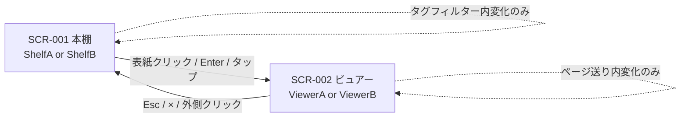

# UI Specification: えほんやさん（Ehon）

> Source: SPEC.md (2026-05-04)
> Source: project-rules.md (2026-05-04)
> Source: モック資産 (`Ehon.html` / `app.jsx` / `tweaks-panel.jsx` / `components/Shelves.jsx` / `components/Viewers.jsx` / `styles/ehon.css`)
> Created: 2026-05-04
> Last updated: 2026-05-05
> Update history:
>   - 2026-05-04: Initial draft (ux-designer / Delivery Flow Light プラン / lightweight visual default 適用)
>   - 2026-05-04: Tweaks パネル / ViewerBar の本番向け縮小 (analyst / 文字サイズ・アクセント色・フォントの UI 削除と固定化)
>   - 2026-05-05: Tweaks パネル / TweaksLauncher を完全削除 (developer / SCR-003 削除、本棚/ビュアー画面の Tweaks ボタン記述を全消去)
>   - 2026-05-06: ビュアーのタッチスワイプ Phase 1 (developer / SCR-002 Interactions の「画面半分タップ」を「左/右スワイプ」に置換、Accessibility 節に補足)
>   - 2026-05-05: ページめくりアニメ強化 Phase 2 (developer / Animations 表に perspective / box-shadow / easing を反映)
>   - 2026-05-05: ViewerA / ViewerB の RTL 化 (developer / SCR-002 ViewerA レイアウト記述を右綴じに、Interactions 表のスワイプ方向を反転、Animations 表のキーフレーム名を flipNextRight / flipPrevLeft / flipNextLeftFade に更新、キーボード行は変更なし)

## 1. Design Policy

> Visual design follows the **lightweight default** applied because
> `visual-designer` was not launched in this plan (Light)。ただし本プロジェクトは
> 既存ハイファイモック（`styles/ehon.css`）が確立したデザイントークン体系を持つため、
> 一般的な lightweight default の代わりに **モック由来トークン** を採用する。
> Standard / Full に昇格する場合は `visual-designer` を起動し `VISUAL_SPEC.md` を生成して
> ここのトークンを正規化する。

### 採用トークン（モック踏襲 / `styles/ehon.css` 由来）

| 区分 | トークン | 値 | 用途 |
|------|----------|---|------|
| 紙 | `--paper` | `#FBF3E0` | 主背景（昼） |
| 紙(濃) | `--paper-2` | `#F4E6C8` | サブ背景・カード背景 |
| 墨 | `--ink` | `#3D2F1F` | 主テキスト（昼） |
| 墨(柔) | `--ink-soft` | `#6B5742` | 補助テキスト |
| アクセント | `--terracotta` | `#E07856` | 主アクセント（CTA, 進捗バー, ボタン） |
| アクセント(濃) | `--terracotta-deep` | `#C24D2C` | ボタン下影 |
| 黄 | `--mustard` | `#E8B53A` | 夜モード主アクセント、バッジ |
| 黄(柔) | `--mustard-soft` | `#F2D88A` | テープ装飾 |
| 抹茶 | `--matcha` | `#7FA886` | 副カラー |
| 抹茶(濃) | `--matcha-deep` | `#4F7A57` | 副カラー濃 |
| 桜 | `--sakura` | `#F2A6B8` | 副カラー |
| 空 | `--sky` | `#A9D6E5` | 副カラー |
| 濃墨 | `--sumi` | `#2B2419` | 夜モード上の文字 |
| 木 | `--shelf-wood` 系 | `#8B5A2B` 他 | ShelfA 木製本棚 |
| 夜・背景 | `--night-bg` | `#1F2440` | 夜モード主背景 |
| 夜・紙 | `--night-paper` | `#2A2F4D` | 夜モードカード |
| 夜・墨 | `--night-ink` | `#F5EBD2` | 夜モード主テキスト |
| 夜・墨(柔) | `--night-ink-soft` | `#C9BFA8` | 夜モード補助テキスト |

> 夜モード `--mustard` (#E8B53A) と `--night-bg` (#1F2440) のコントラスト検証が
> NFR の TBD-002。本実装の visual 検証フェーズで実測する。

### タイポグラフィ

- ボディ既定 (`--font-body`): `'M PLUS Rounded 1c', 'BIZ UDPGothic', system-ui, sans-serif`
- ディスプレイ既定 (`--font-display`): `'Klee One', 'M PLUS Rounded 1c', sans-serif`
- 読み込みは Google Fonts (`display=swap`)。失敗時は `system-ui` フォールバック（IR-003）
- フォントプリセット 6 種は `app.jsx` の `FONT_PRESETS` を移植 (rounded / udp / klee / pop / maru / mincho)

### スペーシング・形状

- 基本グリッド: 8px (4 / 8 / 12 / 14 / 16 / 18 / 20 / 22 / 24 / 28 / 32 / 40 / 60 / 80 px)
- 角丸: ボタン 999px (pill) / カード 6〜18px / 入力 4px
- 影: ボタン下影 `0 3px 0 var(--terracotta-deep)`、カード `0 12px 24px rgba(0,0,0,0.18)`、ビュアー `0 30px 60px rgba(0,0,0,0.18)`
- 線太さ: ボーダー 1.5〜3px

### アクセシビリティ

- 目標水準: WCAG 2.1 AA（コントラスト 4.5:1）
- フォーカスリング: `outline: 2px solid var(--terracotta); outline-offset: 2px;`（実装側で全インタラクティブ要素に適用）
- タップ領域: 最小 44×44px
- `prefers-reduced-motion: reduce` で `flipNextLeft` / `floaty` / `slideInRight` / `viewerIn` 等のアニメ無効化
- `<ruby>` 構造は CSS で `<rt>` の `display` のみ切替、SR 互換性を維持

### レスポンシブ・ブレークポイント

- PC: ≥ 901px (主要ターゲット)
- タブレット: ≤ 900px (主要ターゲット)
- スマホ: ≤ 560px (下位互換)

### Tone & Manner

- やわらか / あたたかい / 子ども（3〜5歳）が安心して触れる
- 過度な装飾を避け、絵本の物理感（紙・木・テープ）を控えめに表現

---

## 2. Screen Transition Flow



> 物理スクリーンは 2 つ (Home / Viewer)。Tweaks パネルは廃止済 (2026-05-05 / ADR-009)。
> ページ送りは Viewer 内の状態変化のため SCR を分けない。
> URL ルーティングは存在しない（FR-020 / UC-019 が Could 採用なら `?shelf=B&viewer=A&open={id}` のクエリパラメータのみ）。

---

## 3. Screen List

| Screen ID | Screen Name | Corresponding UC | URL Path | Description |
|----------|------------|------------------|----------|------------|
| SCR-001 | 本棚（Home） | UC-001 〜 UC-004, UC-016, UC-017 | `/` (オプション: `?shelf=A\|B&tag=...`) | 物語一覧。ShelfA / ShelfB バリアント切替、タグフィルター |
| SCR-002 | ビュアー（Viewer） | UC-005 〜 UC-011, UC-016, UC-017, UC-018 | `/` （Home オーバーレイ） | 物語を読む画面。ViewerA / ViewerB バリアント切替、表紙ページ + 本文ページ |
| ~~SCR-003~~ | ~~Tweaks パネル~~ | ~~UC-014~~ | — | (削除: 2026-05-05 / ADR-009) Tweaks パネルは廃止。等価操作は ShelfSwitcher / ViewerBar で提供 |

---

## 4. Screen Details

### SCR-001: 本棚（Home）

**Purpose:** 6 作品の物語を一覧表示し、タグで絞り込み、選んでビュアーへ遷移する
**Corresponding UC:** UC-001 〜 UC-004, UC-016, UC-017
**Transitions:** （初期画面）→ ビュアー (SCR-002) / Tweaks (SCR-003)
**URL path:** `/`（オプション: `?shelf=A|B`）

#### Layout Structure (ShelfA: 立てかけ書架)

```
┌───────────────────────────────────────────────────────────────────────┐
│ ┌─────────┐  えほんやさん                              ┌─────────────┐│
│ │  本     │  Ehon — よみたいおはなしを えらんでね      │ほんだな A|B ││
│ └─────────┘                                            └─────────────┘│
├───────────────────────────────────────────────────────────────────────┤
│   きょうは どのおはなしを よもうかな？                                │
│   本のせなかを タップすると、おはなしがはじまります                   │
│                                                                       │
│ ┌──────────────────────────────────────────────────────────────────┐  │
│ │ おはなしの しゅるい [ ぜんぶ | グリム童話 | 日本昔話 ]           │  │
│ └──────────────────────────────────────────────────────────────────┘  │
│                                                                       │
│ ╔═══════════════════════════════════════════════════════════════════╗ │
│ ║ ▓▓ ▓▓ ▓▓ ▓▓ ▓▓ ▓▓ (背表紙: 縦書きタイトル + 絵文字)           ▒ ║ │
│ ║ ▓▓ ▓▓ ▓▓ ▓▓ ▓▓ ▓▓                                             ▒ ║ │
│ ║ ▓▓ ▓▓ ▓▓ ▓▓ ▓▓ ▓▓                                             ▒ ║ │
│ ║━━━━━━━━━━━━━━━━━━━━━━━━━━━━━━━━━━━━━━━━━━━━━━━━━━━━━━━━━━━━━━━━━║ │
│ ║                            (床板)                                ║ │
│ ╚═══════════════════════════════════════════════════════════════════╝ │
└───────────────────────────────────────────────────────────────────────┘
```

#### Layout Structure (ShelfB: 表紙ならべ)

```
┌───────────────────────────────────────────────────────────────────────┐
│ ┌─────────┐  えほんやさん                              ┌─────────────┐│
│ │  本     │  Ehon — おやすみまえの よみきかせに        │ほんだな A|B ││
│ └─────────┘                                            └─────────────┘│
├───────────────────────────────────────────────────────────────────────┤
│  ようこそ                                                             │
│  きょうの おはなし を えらぼう              6 さつの えほん            │
│                                                                       │
│  おはなしの しゅるい [ ぜんぶ | グリム童話 | 日本昔話 ]              │
│                                                                       │
│  ┌─────────┐ ┌─────────┐ ┌─────────┐ ┌─────────┐                    │
│  │  🧣     │ │  🍑     │ │  👸     │ │  🦢     │                    │
│  │ 赤ずきん │ │ 桃太郎  │ │ 白雪姫  │ │つるの…  │                    │
│  │グリム童話│ │日本昔話 │ │グリム童話│ │日本昔話 │                    │
│  └─────────┘ └─────────┘ └─────────┘ └─────────┘                    │
│  ┌─────────┐ ┌─────────┐                                             │
│  │  🐓     │ │  🪔     │                                             │
│  │ ブレ…   │ │ かさじぞう│                                            │
│  │グリム童話│ │日本昔話 │                                             │
│  └─────────┘ └─────────┘                                             │
└───────────────────────────────────────────────────────────────────────┘
```

#### Component Details

| # | Component | Type | State | 説明 |
|---|-----------|------|-------|------|
| 1 | `<Header>` | layout | static | ロゴマーク (52×52, 角丸, 4° 傾き) + サービス名「えほんやさん」+ サブテキスト「Ehon — …」 |
| 2 | `<ShelfSwitcher>` | toggle pill | active / inactive | 「ほんだな」ラベル + ［📚 立てかけ / 🗂 表紙ならべ］。Tweaks 永続化 |
| 3 | `<TagFilter>` | segmented control | selected / unselected | "ぜんぶ" + 各タグの単一選択。タグは `collectTags(stories)` で動的列挙（MVP では「グリム童話」「日本昔話」） |
| 4 | `<ShelfA>` 本棚エリア | composite | n/a | 木目背景 + 並んだ背表紙 + 床板 + 装飾(ランプ等)。本棚高さは中身に応じて可変 |
| 5 | `<BookSpine>` (ShelfA 内) | clickable card | default / hover (translateY -12px, rotate -2°) / focus / disabled | 縦書きタイトル + 下部絵文字。物語の `spine` 色を背景。クリックで `onOpen(id)`。`role="button"`, `aria-label="{title} をひらく"` |
| 6 | `<ShelfB>` グリッド | composite | n/a | `auto-fill, minmax(220px, 1fr)` 列、gap 28px |
| 7 | `<CoverCard>` (ShelfB 内) | clickable card | default / hover (translateY -6px) / focus | 3:4 縦長カバー + 著者バッジ + 中央絵文字 + 表題。下にメタ（タイトル + description + ミニタグ） |
| 8 | `<EmptyState>` | message | shown when filtered.length === 0 | 「🔍 このタグの えほんは まだないよ」 |

#### Interactions

| Trigger | Action | Feedback |
|---------|--------|----------|
| 表紙(背表紙)クリック / タップ / Enter | `onOpen(story.id)` → `<Viewer>` をオーバーレイ表示 | viewerIn 0.35s ease（reduced-motion で停止） |
| 表紙にフォーカス（Tab） | `outline: 2px solid var(--terracotta); outline-offset: 2px` | フォーカス後 Enter で開く |
| ShelfSwitcher 切替 | `settings.shelfVariant` 更新 + localStorage 反映 | アクティブピル背景反転 (墨 → 紙)、即時レイアウト切替 |
| タグチップ選択 | `selectedTags = [tagName]` (単一)、"" は空配列 | チップ active 反転 (terracotta 背景 + 白文字) |
| ホバー (PC) | カードリフトアニメーション | `@media (hover: none)` で抑制 |

#### State Patterns

| State | 条件 | 表示 |
|-------|------|------|
| Default | `filteredStories.length > 0` | ShelfA: 並んだ背表紙、ShelfB: 表紙グリッド |
| Empty | `filteredStories.length === 0` | EmptyState メッセージ |
| Night | `settings.night === true` | `.night` クラス付与、palette を夜パレットに切替 |
| Loading | （MVP では不要 / 全静的） | — |
| Error | （MVP では不要 / Error Boundary は IR-008 で別系統） | — |

---

### SCR-002: ビュアー（Viewer）

**Purpose:** 選択された物語を表紙 → 本文の順で読み進める
**Corresponding UC:** UC-005 〜 UC-011, UC-016, UC-017, UC-018
**Transitions:** ← 本棚 (SCR-001)
**URL path:** `/`（Home オーバーレイ。オプション: `?open={storyId}&page={N}` を Could で許容）

#### Layout Structure (ViewerA: 見開き)

> Updated: 2026-05-04 — ViewerBar から「あ- / あ+ (文字サイズ ±)」を削除。
> 文字サイズは 26px 固定。

```
┌───────────────────────────────────────────────────────────────────────┐
│ ◀ 赤ずきん [グリム童話]         ふりがな[ON] 夜モード A|B  ✕ 閉じる   │
├───────────────────────────────────────────────────────────────────────┤
│ ▓▓▓▓▓▓▓▓▓░░░░░░░░░░░░░░░░░░░░░░ (進捗バー 4px, 紅褐色)              │
├───────────────────────────────────────────────────────────────────────┤
│                                                                       │
│   ╔═════════════╤═════════════╗                                       │
│   ║             │             ║                                       │
│   ║   (右:絵)   │ (左:本文)   ║                                       │
│   ║   illust    │ むかしむかし、 ║◀━━━━━ 56px 円形 ▶                  │
│   ║   140px     │ あるところに… ║                                     │
│   ║             │             ║                                       │
│   ║             │       3/8   ║                                       │
│   ╚═════════════╧═════════════╝                                       │
│                       page 3 / 8                                      │
└───────────────────────────────────────────────────────────────────────┘
```

#### Layout Structure (ViewerB: 全画面背景)

```
┌───────────────────────────────────────────────────────────────────────┐
│ ◀ 赤ずきん [グリム童話]         ふりがな[ON] 夜モード A|B  ✕ 閉じる   │
├───────────────────────────────────────────────────────────────────────┤
│ ▓▓▓▓▓▓▓▓▓░░░░░░░░░░░░░░░░░░░░░░ (進捗バー 4px)                       │
│                                                                       │
│  ┌──────────────────────────────────────────────────────────────────┐ │
│  │                                                                  │ │
│  │                  ◯  (background image full-bleed                 │ │
│  │                          OR floaty emoji 280px)                  │ │
│  │                                                                  │ │
│  │                                                                  │ │
│  │             ┌─────── テープ ───────┐                             │ │
│  │             │ むかしむかし、あるところに… │                        │ │
│  │             │ (textcard, 紙色 + 影 + テープ装飾)                 │ │
│  │             └────────────────────────┘                          │ │
│  │                                                                  │ │
│  │                       page 3 / 8                                 │ │
│  └──────────────────────────────────────────────────────────────────┘ │
│  ◀ (左 56px 円形)                              ▶ (右 56px 円形)       │
└───────────────────────────────────────────────────────────────────────┘
```

#### 表紙ページ（pageIndex === 0, 両バリアント共通）

```
┌──────────────────────────────────────────────────────────────────────┐
│                  (背景: cover.webp eager OR coverColor 色面)         │
│                                                                      │
│                            🧣                                        │
│                          赤ずきん                                    │
│                       グリム童話                                     │
│                                                                      │
│                   [ よみはじめる ]   ← 白丸ボタン 12×32, 太字        │
│                                                                      │
└──────────────────────────────────────────────────────────────────────┘
```

#### Component Details

| # | Component | Type | State | 説明 |
|---|-----------|------|-------|------|
| 1 | `<ViewerBar>` | top toolbar | static | タイトル + 著者バッジ / ふりがなトグル / 夜モード / ViewerSwitcher A\|B / 閉じる ✕ (2026-05-04: 文字サイズ ± を削除) |
| 2 | `<ProgressBar>` | progress | width: pageIndex / pages.length | 4px 高、`--terracotta`（夜は `--mustard`） |
| 3 | `<ViewerStage>` | content area | per page | ViewerA: `<BookA>` 見開き / ViewerB: `<BookB>` 全画面背景。表紙 (pageIndex=0) は両バリアント共通の `<CoverOverlay>` |
| 4 | `<NavButton>` | circular button | default / hover (scale 1.07) / disabled (opacity 0.25) | 56×56px (PC) / 44×44px (タブレット) / 38×38px (スマホ)。`aria-label="まえのページ" / "つぎのページ"` |
| 5 | `<PageNumber>` | label | 表示は本文のみ | `{n} / {total}` 表示。表紙ページでは非表示 |
| 6 | `<CoverPage>` | composite | pageIndex === 0 | 物語タイトル(大) + 著者 + 「よみはじめる」CTA。背景は `cover.webp`(eager) or `coverColor` 色面 |
| 7 | `<IllustWithFallback>` | image | loaded / fallback | ``。エラー時は `placeholderEmoji` + `bg` 色面に切替 |
| 8 | `<RubyText>` | inline composite | ruby on / off | `桃太郎{ももたろう}` を `<ruby><rb>...</rb><rt>...</rt></ruby>` に変換。off 時 `.no-ruby rt { display:none }` |

#### Interactions

| Trigger | Action | Feedback |
|---------|--------|----------|
| 「よみはじめる」CTA タップ / Enter | `pageIndex = 1` | viewerIn / slideInRight アニメ（reduced-motion で停止） |
| ▶ ボタン / → キー / **右スワイプ** (タッチ, 右綴じ) | `pageIndex++` (max: pages.length-1) | `flipNextRight` (A) / `slideInRight` (B) |
| ◀ ボタン / ← キー / **左スワイプ** (タッチ, 右綴じ) | `pageIndex--` (min: 0) | `flipPrevLeft` (A) / `slideInLeft` (B) |
| Esc キー / ✕ ボタン | `onClose()` → 本棚へ戻る | viewer フェードアウト、本棚スクロール位置保持 |
| ふりがなトグル | `settings.ruby` トグル | `<rt>` 即時表示切替 |
| 夜モードトグル | `settings.night` トグル | 全画面の `.night` クラス切替（昼夜パレット遷移） |
| ViewerSwitcher A|B | `settings.viewerVariant` 切替 | レイアウト即時切替（pageIndex 保持） |
| ビュアー入場時 | フォーカスを `<NavButton.next>` または「よみはじめる」CTA に移動 | キーボードユーザビリティ (IR-007) |
| ビュアー離脱時 | フォーカスを直前にクリックされた表紙要素へ復帰 | 同上 |

#### Validation

該当なし（フォーム入力なし）。

#### State Patterns

| State | 条件 | 表示 |
|-------|------|------|
| Cover | `pageIndex === 0` | `<CoverPage>` 表示、← ボタン disabled |
| Reading | `0 < pageIndex < pages.length-1` | 通常ページ表示、両ナビ有効 |
| Last page | `pageIndex === pages.length-1` | → ボタン disabled、最終ページ表示 |
| Image fallback | 画像取得失敗 | `<IllustWithFallback>` が `placeholderEmoji` + `bg` 色面に切替（UC-018） |
| Night | `settings.night === true` | 夜パレットに切替 |
| Reduced motion | `prefers-reduced-motion: reduce` | 全アニメーションを停止 / 短縮 |
| Viewer transition | バリアント切替直後 | レイアウトのみ切替、ページは保持 |

---

### SCR-003: (削除: Tweaks パネル / 2026-05-05)

> Updated: 2026-05-05 (Tweaks 機能の完全削除 / ADR-009)
>
> TweaksPanel / TweaksLauncher は本実装から完全に削除した。
> 等価操作は ShelfSwitcher (本棚バリアント) および ViewerBar (ビュアーバリアント / ふりがな / 夜モード) で提供済み。
> 経緯と方針は `docs/design-notes/remove-tweaks-panel.md` を参照。

---

## 5. Shared Components

| Component | 用途 | Props 概念 |
|-----------|------|-----------|
| `<Logo>` | ヘッダー左、サービス名表示 | （なし。サブテキストはバリアントで切替） |
| `<ShelfSwitcher>` | 本棚バリアント切替 | `value: "A"\|"B"`, `onChange`, `night` |
| `<ViewerSwitcher>` | ビュアーバリアント切替 | `value: "A"\|"B"`, `onChange`, `night` |
| `<TagFilter>` | タグ単一選択 | `tags`, `selected`, `setSelected`, `variant`, `night` |
| `<RubyText>` | ルビ記法を `<ruby>` に変換 | `text` (`漢字{かんじ}`形式) |
| `<IllustWithFallback>` | 挿絵 + フォールバック | `storyId`, `scene`, `placeholderEmoji`, `bgColor`, `eager?` |
| `<EhButton>` | 共通ボタン (`.eh-btn`, `.eh-btn.ghost`, `.eh-btn.icon-btn`) | `variant`, `onClick`, `aria-label` |
| `<EmptyState>` | 空タグ時メッセージ | `message` |
| `<ProgressBar>` | ビュアー進捗バー | `value` (0〜1) |
| `<ErrorBoundary>` | クラッシュ時フォールバック (IR-008) | `fallback` |

---

## 6. Responsive Design Policy（per screen specifics）

正規ブレークポイントは Section 1 を参照（PC ≥ 901 / タブレット ≤ 900 / スマホ ≤ 560）。
画面ごとの挙動差分:

### SCR-001 (本棚)
- **タブレット (≤900px)**: ヘッダー padding 削減、ロゴ 24px、`<ShelfSwitcher>` ラベルのみ非表示にし icon+text 残す。ShelfA は本棚エリアを横スクロールに切替。ShelfB grid は `minmax(150px, 1fr)`
- **スマホ (≤560px)**: ロゴサブテキスト非表示、ロゴ 20px、ShelfA 背表紙幅 54px、ShelfB grid `repeat(2, 1fr)`、タグフィルタは横スクロール

### SCR-002 (ビュアー)
- **タブレット (≤900px)**: バー padding 削減、ナビボタン 44px、ViewerA 見開きを縦積み (右=絵 38% / 左=文 62%)
- **スマホ (≤560px)**: バー高圧縮、タイトルバッジ非表示、ナビボタン 38px (opacity 0.85)、ViewerA 見開きを右=絵 32%/左=文 68%、ViewerB の本文カードを画面端いっぱいに、表紙タイトル 32px

### iPad Safari `100vh` ずれ（R-004）対策
- すべての画面で `100dvh`（フォールバック `100vh`）を採用
- ビュアーは `position: fixed; inset: 0; height: 100dvh;`

### `@media (hover: none)`
- カードリフト・背表紙ホバーアニメを停止（モック既存 CSS 踏襲）

---

## 7. Accessibility Requirements（per screen specifics）

正規水準は Section 1 を参照（WCAG 2.1 AA）。画面ごとの追加要件:

### SCR-001 (本棚)
- 各表紙には `role="button"` + `aria-label="{title} をひらく"`
- タグチップは `role="radio"` + `aria-checked` で単一選択を表現（`role="radiogroup"` でラップ）
- ShelfSwitcher は `role="tablist"` + `aria-selected` を採用

### SCR-002 (ビュアー)
- ビュアー root に `role="dialog"` + `aria-modal="true"` + `aria-labelledby` でタイトル参照
- ナビボタン: `aria-label="まえのページ" / "つぎのページ"` + 末端ページで `aria-disabled`
- 進捗バー: `role="progressbar"` + `aria-valuenow / valuemin / valuemax`
- 本文の `<ruby>` 構造を維持し、SR が「漢字 → 読み」の順に読み上げる挙動を VoiceOver / NVDA で検証
- フォーカス管理: 開いた瞬間に「よみはじめる」CTA(表紙) または 次ボタン(本文)に移動。閉じた時、トリガー要素に復帰 (IR-007)
- キーボード (←/→/Esc) とナビボタン (◀/▶) は引き続き使用可能。スワイプは追加手段であり、SR / キーボード操作の代替ではない (ADR-010)
- RTL 化 (ADR-012): ViewerA 見開きの DOM 順序は `.book-a-page.right`（絵）→ `.book-a-page.left`（文）。右→左の reading order で WCAG 1.3.2 に準拠 (R-023)

### 共通
- すべてのインタラクティブ要素に `:focus-visible` で 2px outline (terracotta)
- タップ領域 ≥ 44×44px（モック CSS が一部 56×56px 採用）
- `prefers-reduced-motion: reduce` で `flipNextRight` / `flipPrevLeft` / `flipNextLeftFade` / `floaty` / `slideInRight` / `viewerIn` 等を無効化
- 夜モード `--mustard` のコントラストは visual 検証フェーズで実測 → 4.5:1 未達なら代替色を導入（TBD-002 / R-001）

---

## 8. Animations / Transitions

| 名前 | 適用先 | duration | easing | 中間キー | reduced-motion |
|------|--------|----------|--------|----------|----------------|
| `viewerIn` | ビュアー入場 | 0.35s | ease | — | 停止 (opacity 即時 1) |
| `flipNextRight` | ViewerA 次ページ (右ページが左へ回転) | 0.55s | ease-in | 50%: `box-shadow: 20px 0 30px rgba(0,0,0,0.3)` (紙の厚み, 右側) | 停止 (即時切替) |
| `flipNextLeftFade` | ViewerA 次ページ左フェード | 0.55s | ease-out | 40%: `opacity: 0` (フェード開始を前倒し) | 停止 |
| `flipPrevLeft` | ViewerA 前ページ (左ページが右へ回転) | 0.55s | ease-in | 50%: `box-shadow: -20px 0 30px rgba(0,0,0,0.3)` (紙の厚み, 左側) | 停止 |
| `slideInRight` | ViewerB 次ページ背景 | 0.5s | `cubic-bezier(0.2, 0.8, 0.2, 1)` | — | 停止 |
| `slideInRightCard` | ViewerB 次ページカード | 0.5s | `cubic-bezier(0.2, 0.8, 0.2, 1)` | — | 停止 |
| `slideInLeft` / `slideInLeftCard` | ViewerB 前ページ | 0.5s | `cubic-bezier(0.2, 0.8, 0.2, 1)` | — | 停止 |
| `floaty` | ViewerB 背景 emoji | 4s infinite | ease-in-out | — | 停止（位置固定） |
| カードホバーリフト | ShelfA / ShelfB | 0.2s | ease | — | 停止（hover: none） |
| ページめくりアニメ全般 | ViewerA / ViewerB | — | — | — | `@media (prefers-reduced-motion: reduce)` で `animation: none` |

> **Phase 2 追加 (2026-05-05):** `.book-a` に `perspective: 1500px` + `transform-style: preserve-3d` を付与。
> 子要素の `rotateY` アニメが立体的に表示される (AC2-2)。`prefers-reduced-motion: reduce` 時は
> `reduced-motion.css` の `animation: none !important` により中間キーのキーフレームを含む全アニメが停止 (AC2-4)。
>
> CSS は `styles/ehon.css` の `@keyframes` をそのまま `src/styles/` に移植する。
> reduced-motion 対応は `src/styles/reduced-motion.css` で統合管理 (`@media (prefers-reduced-motion: reduce) { ... animation: none !important; }`)。
>
> **RTL 化 (2026-05-05 / ADR-012):** キーフレーム名を右綴じ仕様に改名。`flipNextRight`（右ページが左へ回転）/
> `flipNextLeftFade`（左ページのフェードイン）/ `flipPrevLeft`（左ページが右へ回転）。
> duration / easing / 中間キー位置 / 不透明度 / blur / cubic-bezier の値は Phase 2 確定値を据え置き (ACR-9)。

---

## AGENT_RESULT

```
AGENT_RESULT: ux-designer
STATUS: success
ARTIFACTS:
  - docs/UI_SPEC.md
SCREENS: 3
COMPONENTS: 12
RESPONSIVE: true
ACCESSIBILITY: WCAG AA
VISUAL_POLICY: lightweight-default (mock-derived tokens)
NEXT: architect
```
